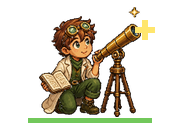
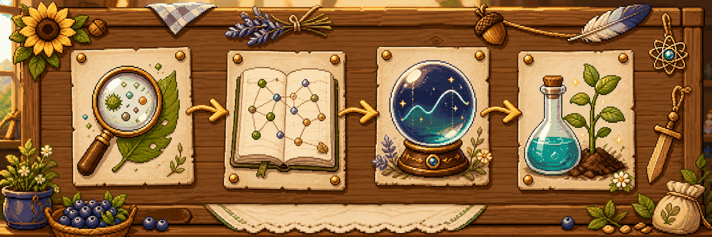
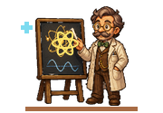

### 🌻 Welcome to Gusuhanfeng's Research Farm 🌻

**AI for Science @ Harbin Institute of Technology, Shenzhen**

`🔬 grow questions` · `🧪 run experiments` · `🌱 harvest discoveries`

*Building knowledge the way a farm grows: patiently, season by season.*

## 🌾 Meet the Researcher

<table>
<tr>
<td width="58%" valign="top">

### My research plot

I explore **AI for Science** — how intelligent systems can reveal hidden patterns, generate testable hypotheses, and accelerate scientific discovery.

I care about more than whether a model works. I want to understand **why it works, where it fails, and how evidence can improve it**.

</td>
<td width="42%" valign="top">

### Farm coordinates

- 🎓 **HIT (Shenzhen)**
- 🤖 **AI for Science**
- ⚛️ Quantum mechanics
- 🧪 Scientific discovery
- 🛠️ One experiment at a time

</td>
</tr>
</table>

> “Science cannot solve the ultimate mystery of nature.” — Max Planck

## 📌 Research Quest Board

`OBSERVE  →  REPRESENT  →  PREDICT  →  EXPERIMENT  →  DISCOVER`

## 🎒 Backpack

<table>
<tr>
<td width="50%" valign="top">

### 🟨 Sunny curiosity

A yellow sponge and a pink starfish live beside the pond — reminders to stay enthusiastic, playful, and open to strange questions.

</td>
<td width="50%" valign="top">

### ⚛️ First principles

The valley is still a laboratory. I like asking why something works, where its limits are, and whether it can survive a real test.

</td>
</tr>
<tr>
<td width="50%" valign="top">

### 🗡️ Patient cultivation

The flying cultivator represents what I enjoy in *A Record of a Mortal's Journey to Immortality*: foundations, patience, and steady progress.

</td>
<td width="50%" valign="top">

### 🏰 Strategy builder

The barn and tiny tower carry my love for Honor of Kings and Clash of Clans: teamwork, timing, resource planning, and long-term building.

</td>
</tr>
</table>

## 🐍 Greenhouse Mini-game

<picture>
  <source media="(prefers-color-scheme: dark)" srcset="https://raw.githubusercontent.com/Gusuhanfeng/Gusuhanfeng/output/knowledge-snake-dark.svg" />
  <source media="(prefers-color-scheme: light)" srcset="https://raw.githubusercontent.com/Gusuhanfeng/Gusuhanfeng/output/knowledge-snake.svg" />
  
</picture>

A fixed AI SCIENCE crop field — playful, not a contribution counter.

### `STAY CURIOUS · GROW PATIENTLY · PLAY THE LONG GAME`

The farm is open. New experiments will sprout when they are ready.

