<div align="center">



<br />



### Hey, I'm Gusuhanfeng 👋

**AI for Science @ Harbin Institute of Technology, Shenzhen**

`⚛ quantum curious` · `🔬 experiment driven` · `🎮 strategy minded` · `🌊 playful by nature`

*Turning curiosity into questions, questions into experiments, and experiments into discovery.*

</div>

---

## 👨‍🚀 About This Player

<table>
<tr>
<td width="58%" valign="top">

### Research Identity

I explore **AI for Science** — how intelligent systems can reveal hidden patterns, generate testable hypotheses, and accelerate scientific discovery.

I care about more than whether a model works. I want to understand **why it works, where it fails, and how we can test it**.

</td>
<td width="42%" valign="top">

### Coordinates

- 🎓 **HIT (Shenzhen)**
- 🤖 **AI for Science**
- ⚛️ Quantum mechanics
- 🧪 Scientific discovery
- 🛠️ One experiment at a time

</td>
</tr>
</table>

> “Science cannot solve the ultimate mystery of nature.” — Max Planck

## 🔭 Research Transmission

<div align="center">

```text
OBSERVE  →  REPRESENT  →  PREDICT  →  EXPERIMENT  →  DISCOVER
```

</div>

<table>
<tr>
<td width="33%" align="center" valign="top">

### 01 · Observe

Find the question hidden inside the noise.

</td>
<td width="33%" align="center" valign="top">

### 02 · Model

Turn structure into something testable.

</td>
<td width="34%" align="center" valign="top">

### 03 · Discover

Let evidence decide what survives.

</td>
</tr>
</table>

## 🪐 Personal Universe

<table>
<tr>
<td width="50%" valign="top">

### 🟨 Curiosity Mode

SpongeBob-level enthusiasm for unfamiliar ideas: begin with the simplest question and enjoy figuring things out.

</td>
<td width="50%" valign="top">

### 🩷 Imagination Mode

Patrick-level freedom to ask unusual questions — because useful ideas often begin before they look reasonable.

</td>
</tr>
<tr>
<td width="50%" valign="top">

### 🗡️ Cultivation Mode

Inspired by *A Record of a Mortal's Journey to Immortality*: stay patient, build foundations, and keep moving through uncertainty.

</td>
<td width="50%" valign="top">

### 🎮 Strategy Mode

Honor of Kings brings timing and teamwork; Clash of Clans brings long-term building, resource planning, and iteration.

</td>
</tr>
</table>

## 🐍 Knowledge Snake

<div align="center">

<picture>
  <source media="(prefers-color-scheme: dark)" srcset="https://raw.githubusercontent.com/Gusuhanfeng/Gusuhanfeng/output/knowledge-snake-dark.svg" />
  <source media="(prefers-color-scheme: light)" srcset="https://raw.githubusercontent.com/Gusuhanfeng/Gusuhanfeng/output/knowledge-snake.svg" />
  
</picture>

<sub>A fixed AI SCIENCE grid — playful, not a contribution counter.</sub>

</div>

---

<div align="center">

### `STAY CURIOUS · THINK IN QUANTA · PLAY THE LONG GAME`

<sub>Quantum ocean lab under construction. New experiments will appear when they are ready.</sub>

</div>
