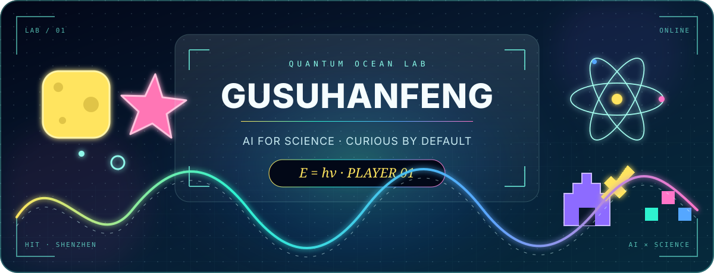

<div align="center">



### 👋 你好，我是 Gusuhanfeng

**哈尔滨工业大学（深圳） · AI for Science**

把好奇心变成问题，把问题变成实验，再把实验变成一点点进步。

</div>

---

## 🔬 我的研究坐标

我正在探索 **AI for Science**：关心 AI 如何帮助我们理解规律、提出假设与加速科学发现。

```text
Observation → Representation → Prediction → Experiment → New understanding
```

> “Science cannot solve the ultimate mystery of nature.” — Max Planck

## 🧭 我的个人调色盘

<table>
<tr>
<td width="50%" valign="top">

### 🟨 海绵宝宝式好奇

对新东西保持热情，愿意从最基础的问题开始，一点点把事情弄明白。

</td>
<td width="50%" valign="top">

### 🩷 派大星式脑洞

允许自己偶尔放空，也相信看似离谱的问题里，可能藏着有趣的方向。

</td>
</tr>
<tr>
<td width="50%" valign="top">

### ⚛️ 普朗克式追问

比起“看起来有效”，我更想知道它为什么有效、边界在哪里、能否被验证。

</td>
<td width="50%" valign="top">

### 🎮 策略玩家心态

《王者荣耀》让我享受配合与节奏，《部落冲突》让我喜欢长期建设和资源规划。

</td>
</tr>
</table>

## 🧪 当前状态

- 🎓 在哈尔滨工业大学（深圳）学习与研究
- 🤖 研究方向：AI for Science
- 🌊 对量子力学、科学发现与有趣的 AI 应用保持好奇
- 🛠️ 主页和代码都在持续建设中——先认真做好每一次实验

<div align="center">

### `Stay curious. Build patiently. Think in quanta.`

<sub>这里暂时没有项目陈列柜，先放一间正在生长的量子海底实验室。</sub>

</div>
