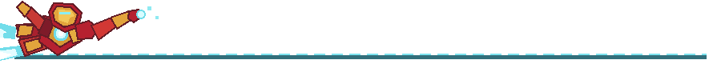

# Gusuhanfeng

**哈尔滨工业大学（深圳） · AI 工程 / AI for Science**

把模型能力做成可靠、可验证、真正能交付的系统。

Stay curious. Build patiently. Test against reality.

## 关于我

我关注 AI 如何进入真实世界：不只让模型给出答案，也让系统知道证据来自哪里、失败时如何收口、上线后能否稳定运行。

目前的兴趣集中在 **Agent 系统、AI 应用工程、计算机视觉与 AI for Science**。相比堆叠功能，我更在意边界、可恢复性，以及一个原型如何一步步变成可以被使用的产品。

## 实习项目

### AI 网球相机 · 进行中

`Edge AI` · `Computer Vision` · `Agent Systems` · `Python`

一个面向网球训练场景的双人协作项目：从视频与相机输入出发，逐步完成姿态、球与球拍等视觉事实提取，并让 Agent 基于可回查的证据生成训练反馈。

我负责本地建模与 Edge Agent 方向，包括开源模型调研与适配、端侧运行时、输入与状态契约、失败降级和可视化证据。当前工作采用分阶段验证：先证明输入、字段与失败路径，再推进真实模型和设备，不把候选结果当成最终能力。

### 圆桌 AI · 过往

`Go` · `TypeScript` · `Next.js` · `PostgreSQL` · `Redis` · `ConnectRPC`

一个面向可信 AI 分身、持续工作和多人智能协作的平台。实习期间，我以 `Gusuhanfeng` 账号完成并合入 **65 个 PR**，工作横跨 Go 控制面、TypeScript Runtime、Web、数据库、模型供应商协议与生产发布。

我的核心工作集中在 AI 分身主链路：将访谈状态机与工具事务收归 Go 控制面，设计回合原子提交和跨进程恢复，建设资料不可逆脱敏与版本化知识装配，并处理模型工具调用、文件解析、沙箱安全及上线验收中的真实故障。

这段经历让我形成了一套稳定的工程习惯：先复现问题，再找到事实所有者；为失败和恢复建立明确边界；最后用 CI、运行状态和生产事实完成验收。

## 公开项目

### [Study Fast](https://github.com/Gusuhanfeng/study-fast)

一个面向快速学习、面试、会议和答辩的开源 Codex Skill。它把零散材料整理为两份互补文档：一份像老师一样耐心讲清概念，另一份把知识、常见问题和回答组织成可直接练习的手册。

## 我在意的事

- **可靠性**：Agent 的成功不仅是模型返回了文本，还包括状态一致、工具受控和失败可恢复。
- **证据**：结论应能回到输入、运行过程和验证结果，而不是只靠漂亮的演示。
- **第一性原理**：理解一个方法为什么有效、何时失效，再决定是否把它放进系统。
- **长期主义**：把复杂问题拆成可以验证的小步，持续交付，而不是追逐短暂的热闹。

One experiment at a time.

